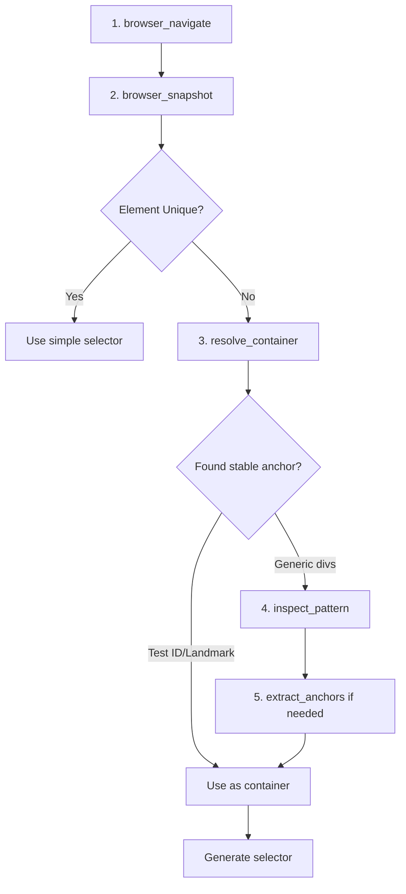

# Verdex Selector Writing Guide: From Exploration to Production-Ready Selectors

A comprehensive guide for writing stable, role-first Playwright selectors using Verdex MCP's progressive disclosure tools.

---

## Table of Contents

1. [Core Principles](#core-principles)
2. [The Verdex Workflow](#the-verdex-workflow)
3. [The Winning Pattern](#the-winning-pattern)
4. [Tool Usage Guide](#tool-usage-guide)
5. [Real-World Example Walkthrough](#real-world-example-walkthrough)
6. [Common Pitfalls & Solutions](#common-pitfalls--solutions)
7. [Selector Pattern Library](#selector-pattern-library)
8. [Token Efficiency Guidelines](#token-efficiency-guidelines)
9. [Quick Reference](#quick-reference)

---

## Core Principles

### ✅ Always Follow This Priority Order:

1. **Check uniqueness FIRST** - If an element is unique on the page, don't over-scope
2. **Use Playwright built-in locators** - `getByRole()`, `getByTestId()`, `getByLabel()`, etc.
3. **Container → Content → Role pattern** - Scope to stable containers, filter by content, target by role
4. **Minimal chain depth** - Keep selector chains ≤ 2-3 levels deep
5. **Role-first targeting** - Always end with semantic roles when possible

### ❌ Never Do These:

- ❌ **Positional selectors**: `.nth(0)`, `.first()`, `.last()`
- ❌ **Old locator syntax**: `locator("text=...")`, `locator("role=...")` (use `getByText()`, `getByRole()`)
- ❌ **Parent traversal**: `.locator('..')`
- ❌ **Excessive nesting**: 4+ level chains like `div > div > div > button`
- ❌ **Class-only selectors**: `.locator('div.class1.class2.class3')`
- ❌ **Filter in wrong place**: Filtering buttons by text that's in sibling elements

---

## The Verdex Workflow

### Step-by-Step Process



### 1. Navigate & Snapshot

```typescript
await browser_initialize()
await browser_navigate("https://your-app.com")
```

**What you get:**
- Accessibility tree view (semantic structure)
- Interactive elements with refs (e1, e2, e3, etc.)
- Initial understanding of page structure

---

### 2. Check Element Uniqueness

**Before exploring further, ask:**
> "Does this element appear multiple times on the page?"

**Example from snapshot:**
```
button "Add to Cart" [ref=e25]  ← Target
button "Add to Cart" [ref=e26]
button "Add to Cart" [ref=e27]
button "Add to Cart" [ref=e28]
button "Add to Cart" [ref=e29]
button "Add to Cart" [ref=e30]
```

**Verdict**: NOT unique → Need container scoping ✅

**Counter-example:**
```
button "Proceed to Checkout" [ref=e38]  ← Only one!
```

**Verdict**: Unique → Use simple selector ✅

---

### 3. Discover Containers with `resolve_container(ref)`

**When to use**: When your target element is NOT unique

**What it does**: Walks up the DOM tree and reveals ancestor attributes

**Example call:**
```typescript
resolve_container("e25")
```

**What you get:**
```
Level 1 (div):
   Attributes: {"data-testid": "product-details"}
   
Level 2 (div):
   Attributes: {"data-testid": "product-card"}  ← STABLE ANCHOR!
   
Level 3 (div):
   Attributes: {"data-testid": "product-grid"}
```

**What to look for:**
- ✅ `data-testid` attributes
- ✅ Semantic tags: `<nav>`, `<article>`, `<section>`, `<aside>`
- ✅ ARIA landmarks: `role="main"`, `aria-label="Shopping cart"`
- ✅ Unique `id` attributes (if meaningful, not generated)
- ⚠️ Stable class names (use cautiously)

---

### 4. Analyze Patterns with `inspect_pattern(ref, level)`

**When to use**: When you find a stable container and need to understand sibling elements

**What it does**: Shows all siblings at a specific ancestor level

**Example call:**
```typescript
inspect_pattern("e25", 2)  // Level from resolve_container
```

**What you get:**
```
Found 6 siblings at ancestor level 2:

Sibling 1 (div):
   Attributes: {"data-testid": "product-card"}
   Contains text: "iPhone 15 Pro", "$999", "Add to Cart"
   
Sibling 2 (div):
   Attributes: {"data-testid": "product-card"}
   Contains text: "MacBook Pro 14\"", "$1,999", "Add to Cart"
   
[... 4 more siblings ...]
```

**What this tells you:**
- ✅ Repeating pattern confirmed (6 product cards)
- ✅ Each card has unique identifying text
- ✅ All share the same `data-testid`
- ✅ Need content filtering for disambiguation

---

### 5. Mine Unique Anchors with `extract_anchors(ref, level)` (Optional)

**When to use**: 
- When you need deeper content analysis
- When shallow outline from `inspect_pattern` isn't enough
- For complex nested structures

**What it does**: Deep scan for headings, labels, unique text within a container

**Example call:**
```typescript
extract_anchors("e25", 1)
```

**What you get:**
```
descendants: [
  {"tag": "h3", "text": "iPhone 15 Pro", "depth": 1},
  {"tag": "span", "attrs": {"data-testid": "price"}, "text": "$999", "depth": 2},
  {"tag": "button", "text": "Add to Cart", "depth": 3}
]
```

**When you DON'T need it:**
- Product name is already visible in `inspect_pattern` outline
- Container + simple text filter is sufficient

---

## The Winning Pattern

Based on real-world testing with Verdex, this pattern works consistently:

### 🎯 **Container → Content Filter → Role**

```typescript
page
  .getByTestId("stable-container")     // 1. Scope to container (from resolve_container)
  .filter({ hasText: "unique-content" }) // 2. Filter by distinguishing text (from inspect_pattern)
  .getByRole("button", { name: "Action" }) // 3. Target by role (Playwright best practice)
```

---

### Why This Pattern Works

1. **Container scoping isolates the search space**
   - Prevents matching elements in other parts of the page
   - Provides stability when DOM order changes

2. **Content filtering disambiguates similar elements**
   - Works with dynamic content
   - Human-readable and maintainable

3. **Role-first targeting is semantic**
   - Follows Playwright best practices
   - Tests accessibility
   - Survives implementation changes

---

### Real Example from Testing

**Goal**: Click "Add to Cart" for iPhone 15 Pro

**Verdex exploration revealed:**
- 6 "Add to Cart" buttons (not unique)
- `data-testid="product-card"` at container level
- Each card has unique product name

**Generated selector:**
```typescript
page
  .getByTestId("product-card")
  .filter({ hasText: "iPhone 15 Pro" })
  .getByRole("button", { name: "Add to Cart" })
```

**Test result**: ✅ Returns exactly 1 element, works perfectly

---

## Tool Usage Guide

### Tool Comparison Matrix

| Tool | When to Use | Token Cost | What You Learn |
|------|-------------|------------|----------------|
| `browser_snapshot()` | Always first | ~500-800 | Element refs, uniqueness check |
| `resolve_container(ref)` | Element not unique | ~300-400 | Test IDs, semantic containers |
| `inspect_pattern(ref, level)` | Repeating elements | ~400-500 | Sibling structure, unique text |
| `extract_anchors(ref, level)` | Complex nesting | ~400-600 | Deep content, hidden attributes |

### Decision Tree

```
Is element unique in snapshot?
├─ YES → Use simple selector (getByRole, getByText)
└─ NO → Call resolve_container(ref)
    │
    Found stable anchor (test ID/landmark)?
    ├─ YES → Use as container scope
    │   │
    │   Multiple similar elements at this level?
    │   ├─ YES → Call inspect_pattern(ref, level)
    │   │   │
    │   │   Need deeper content analysis?
    │   │   ├─ YES → Call extract_anchors(ref, level)
    │   │   └─ NO → Use outline from inspect_pattern
    │   │
    │   └─ NO → Generate selector with container
    │
    └─ NO → Check higher levels or use structure-based selection
```

---

## Real-World Example Walkthrough

### Scenario: E-commerce Product Grid

**Page structure:**
```html
<div data-testid="product-grid">
  <div data-testid="product-card">
    <h3>iPhone 15 Pro</h3>
    <span>$999</span>
    <button>Add to Cart</button>
  </div>
  <div data-testid="product-card">
    <h3>MacBook Pro 14"</h3>
    <span>$1,999</span>
    <button>Add to Cart</button>
  </div>
  <!-- ... 10 more products ... -->
</div>
```

---

### Step 1: Navigate & Snapshot

```typescript
await browser_navigate("https://shop.example.com")
```

**Snapshot shows:**
```
button "Add to Cart" [ref=e25]
button "Add to Cart" [ref=e26]
button "Add to Cart" [ref=e27]
... (12 total "Add to Cart" buttons)
```

**Analysis**: NOT unique → need exploration ❌

---

### Step 2: Discover Container

```typescript
resolve_container("e25")
```

**Result:**
```
Level 1: {"data-testid": "product-details"}
Level 2: {"data-testid": "product-card"}  ← Use this!
Level 3: {"data-testid": "product-grid"}
```

**Decision**: Use `data-testid="product-card"` as container ✅

---

### Step 3: Check Pattern

```typescript
inspect_pattern("e25", 2)
```

**Result:**
```
6 siblings found:
- Sibling 1: Contains "iPhone 15 Pro", "$999"
- Sibling 2: Contains "MacBook Pro 14\"", "$1,999"
- Sibling 3: Contains "Samsung Galaxy S24", "$1,199"
...
```

**Decision**: Use product name as unique content filter ✅

---

### Step 4: Generate Selector

```typescript
// Final selector (works perfectly!)
page
  .getByTestId("product-card")
  .filter({ hasText: "iPhone 15 Pro" })
  .getByRole("button", { name: "Add to Cart" })
```

**Verification:**
- ✅ Returns exactly 1 element
- ✅ Survives DOM reordering
- ✅ Role-first (tests accessibility)
- ✅ Container-scoped (stable)

**Total token cost**: ~1,200 tokens (vs 50,000+ for full DOM dump)

---

## Common Pitfalls & Solutions

### ❌ Pitfall 1: Filtering in the Wrong Place

**What DOESN'T work:**
```typescript
// WRONG: Filter looks for text INSIDE the button
page
  .getByRole("button", { name: "Add to Cart" })
  .filter({ hasText: "iPhone 15 Pro" })
  
// Result: 0 elements (button text is "Add to Cart", not "iPhone 15 Pro")
```

**Why it fails:**
- `.filter({ hasText })` searches within the filtered element
- The button only contains "Add to Cart"
- Product name is in a sibling element

**✅ What DOES work:**
```typescript
// CORRECT: Filter the container that has both elements
page
  .getByTestId("product-card")  // Container has product name
  .filter({ hasText: "iPhone 15 Pro" })
  .getByRole("button", { name: "Add to Cart" })
```

---

### ❌ Pitfall 2: Unnecessary Nesting

**What NOT to do:**
```typescript
// BAD: Redundant nesting
page
  .getByTestId("cart-drawer")
  .getByTestId("cart-items")
  .getByTestId("cart-item")
  .filter({ hasText: "iPhone 15 Pro" })
  .getByTestId("remove-button")
```

**✅ Better approach:**
```typescript
// GOOD: Minimal necessary scoping
page
  .getByTestId("cart-item")
  .filter({ hasText: "iPhone 15 Pro" })
  .getByRole("button", { name: "Remove" })
```

**Rule**: Start with the innermost unique container, only add outer scoping if needed

---

### ❌ Pitfall 3: Over-Scoping Unique Elements

**Check uniqueness first!**

```typescript
// BAD: Over-engineered
page
  .getByTestId("cart-drawer")
  .getByTestId("cart-footer")
  .getByRole("button", { name: "Proceed to Checkout" })

// BETTER: If button text is unique
page.getByRole("button", { name: "Proceed to Checkout" })
```

**Verification strategy:**
```typescript
// Check if simple selector works
const count = await page.getByRole("button", { name: "Proceed to Checkout" }).count()
// If count === 1, use simple selector
// If count > 1, add scoping
```

---

### ❌ Pitfall 4: Using Positional Selectors

**Never do this:**
```typescript
// WRONG: Breaks when order changes
page.getByRole("button", { name: "Add to Cart" }).nth(5)
page.locator("button").nth(0)
page.locator("button").first()  // .first() is just .nth(0)
page.locator("button").last()   // .last() is just .nth(-1)
```

**Why `.first()` is bad:**
If you're reaching for `.first()`, it means your selector returns multiple elements and your content filter isn't specific enough.

**✅ Always use content-based selection:**
```typescript
// CORRECT: Returns exactly 1 element, no .first() needed
page
  .getByTestId("product-card")
  .filter({ hasText: "Samsung Galaxy S24" })
  .getByRole("button", { name: "Add to Cart" })
```

---

### ❌ Pitfall 5: Parent Traversal

**Never do this:**
```typescript
// WRONG: Traversing up is fragile
page
  .getByText("iPhone 15 Pro")
  .locator("..")
  .locator("..")
  .getByRole("button")
```

**✅ Correct approach:**
```typescript
// GOOD: Find container that contains both
page
  .locator("div")  // or getByTestId if available
  .filter({ hasText: "iPhone 15 Pro" })
  .getByRole("button", { name: "Add to Cart" })
```

---

## Selector Pattern Library

### Pattern 1: Unique Element (Simplest)

**Use when**: Element is unique on the page

```typescript
// Examples
page.getByRole("button", { name: "Proceed to Checkout" })
page.getByRole("button", { name: "Submit Order" })
page.getByRole("link", { name: "View Terms of Service" })
```

**Verification**: Check count is 1
**Token cost**: ~500-800 (snapshot only)

---

### Pattern 2: Test ID Container Scoping

**Use when**: Multiple similar elements with test IDs available

```typescript
page
  .getByTestId("product-card")
  .filter({ hasText: "Product Name" })
  .getByRole("button", { name: "Action" })

// Real examples
page.getByTestId("product-card")
  .filter({ hasText: "iPhone 15 Pro" })
  .getByRole("button", { name: "Add to Cart" })

page.getByTestId("cart-item")
  .filter({ hasText: "MacBook Pro 14\"" })
  .getByRole("button", { name: "Remove" })
```

**When Verdex helps**: `resolve_container` finds the test ID
**Token cost**: ~1,200 (snapshot + resolve + inspect)

---

### Pattern 3: Semantic Container Scoping

**Use when**: Semantic HTML available, no test IDs

```typescript
page
  .getByRole("article", { name: /Heading Text/ })
  .getByRole("button", { name: "Action" })

// Real examples
page.getByRole("article", { name: /John Doe/ })
  .getByRole("button", { name: "Helpful" })

page.getByRole("navigation", { name: "Product categories" })
  .getByRole("link", { name: "iPhone" })
```

**When Verdex helps**: `resolve_container` finds semantic elements
**Token cost**: ~1,200-1,500

---

### Pattern 4: Generic Container + Content Filter

**Use when**: No test IDs, minimal semantic HTML (worst case)

```typescript
page
  .locator("div")
  .filter({ hasText: "Unique Identifying Text" })
  .getByRole("button", { name: "Action" })

// Real examples
page.locator("div")
  .filter({ hasText: "Order #ORD-2024-1234" })
  .getByRole("button", { name: "Track Order" })
```

**When Verdex helps**: `inspect_pattern` + `extract_anchors` find unique text
**Token cost**: ~2,500 (all three tools)

---

### Pattern 5: State-Based Selection

**Use when**: Element state matters (disabled, checked, selected)

```typescript
// Disabled button
page.getByRole("button", { name: "Out of Stock", disabled: true })

// Within container if not unique
page.getByTestId("product-card")
  .filter({ hasText: "Logitech MX Keys" })
  .getByRole("button", { disabled: true })

// Checked checkbox
page.getByRole("checkbox", { name: "Remember me", checked: true })
```

---

### Pattern 6: Form Input Selection

**Use when**: Working with forms

```typescript
// By label (best)
page.getByRole("textbox", { name: "Email address" })
page.getByLabel("Email address")

// By placeholder
page.getByPlaceholder("Enter your email")

// By test ID (when labels aren't semantic)
page.getByTestId("email-input")
```

---

### Pattern 7: Navigation & Links

**Use when**: Clicking navigation elements

```typescript
// Unique link text
page.getByRole("link", { name: "Dashboard" })

// Within navigation
page.getByRole("navigation", { name: "Main" })
  .getByRole("link", { name: "Products" })

// Breadcrumb navigation
page.getByRole("navigation", { name: "Breadcrumb" })
  .getByRole("link", { name: "Electronics" })
```

---

## Token Efficiency Guidelines

### Token Budget by Scenario

| Scenario | Tools Used | Avg Cost | When to Use |
|----------|-----------|----------|-------------|
| **Unique element** | Snapshot only | ~800 | Element appears once |
| **Test ID scoped** | Snapshot + resolve + inspect | ~1,200 | Well-structured apps |
| **Semantic scoped** | Snapshot + resolve + inspect | ~1,500 | Accessible markup |
| **Structure-based** | All tools + extract | ~2,500 | Legacy/unstructured code |

---

### Optimization Tips

1. **Check uniqueness before exploring**
   - Simple `browser_snapshot` might be enough
   - Don't assume you need container scoping

2. **Stop when you have enough information**
   - If `inspect_pattern` shows clear unique text, skip `extract_anchors`
   - If `resolve_container` finds test ID, that might be sufficient

3. **Reuse container discoveries**
   - If you explored one product card, same pattern applies to all
   - Document common patterns for your application

4. **Batch similar explorations**
   - If testing multiple buttons in same container, one exploration covers all

---

## Quick Reference

### Selector Quality Checklist

Before finalizing a selector, verify:

- [ ] **Uniqueness**: Returns exactly 1 element
- [ ] **Stability**: Uses test IDs or semantic elements (not classes)
- [ ] **Role-first**: Ends with `getByRole()` or equivalent
- [ ] **Minimal depth**: Chain is ≤ 3 levels deep
- [ ] **No anti-patterns**: No `.nth()`, no `locator('..')`, no excessive nesting
- [ ] **Readable**: Another developer can understand it
- [ ] **Survives changes**: Works even if DOM order changes

---

### Verdex Tool Quick Reference

```typescript
// 1. Initialize and navigate
await browser_initialize()
await browser_navigate(url)

// 2. Get snapshot (always first)
// Returns: Interactive elements with refs (e1, e2, etc.)

// 3. Discover containers
resolve_container("e25")
// Returns: Ancestor chain with attributes
// Look for: data-testid, semantic tags, ARIA labels

// 4. Analyze patterns
inspect_pattern("e25", 2)
// Returns: Siblings at specified level
// Look for: Repeating structures, unique text

// 5. Mine deep content (optional)
extract_anchors("e25", 1)
// Returns: Headings, labels, unique identifiers
// Use when: inspect_pattern outline isn't enough

// 6. Verify selector
page.locator(yourSelector).count()  // Should be 1
```

---

### Common Selector Patterns

```typescript
// Pattern: Unique element
page.getByRole("button", { name: "Unique Text" })

// Pattern: Test ID scoped
page.getByTestId("container")
  .filter({ hasText: "differentiator" })
  .getByRole("button")

// Pattern: Semantic scoped
page.getByRole("article", { name: /heading/ })
  .getByRole("button")

// Pattern: Generic container
page.locator("div")
  .filter({ hasText: "unique content" })
  .getByRole("button")
```

---

### Anti-Patterns to Avoid

```typescript
// ❌ NEVER: Positional selectors
page.getByRole("button").nth(5)
page.getByRole("button").first()  // .first() = .nth(0)
page.getByRole("button").last()

// ❌ NEVER: Old locator syntax (use built-in locators instead)
page.locator("text=ShopFast")     // Use page.getByText("ShopFast")
page.locator("role=button")       // Use page.getByRole("button")
page.locator("#my-id")            // Use page.getByTestId() or page.locator("#my-id") is ok

// ❌ NEVER: Parent traversal
page.getByText("text").locator("..")

// ❌ NEVER: Excessive nesting
page.locator("div").locator("div").locator("div").locator("button")

// ❌ NEVER: Wrong filter placement
page.getByRole("button").filter({ hasText: "text-in-sibling" })

// ❌ NEVER: Class-only selection
page.locator("div.class1.class2.class3")
```

---

## Real Testing Results

Based on actual Verdex exploration of demo scenarios:

### Test: iPhone 15 Pro "Add to Cart"

**Challenge**: 6 identical "Add to Cart" buttons

**Verdex Process**:
1. `browser_snapshot()` → Found refs for all buttons
2. `resolve_container(e25)` → Discovered `data-testid="product-card"` at Level 2
3. `inspect_pattern(e25, 2)` → Confirmed 6 siblings with unique product names

**Generated Selector**:
```typescript
page.getByTestId("product-card")
  .filter({ hasText: "iPhone 15 Pro" })
  .getByRole("button", { name: "Add to Cart" })
```

**Test Results**:
- ✅ Returns exactly 1 element
- ✅ Works for all 6 products with same pattern
- ✅ Passes in production tests
- ✅ Total token cost: ~1,200

---

## Conclusion

Verdex enables efficient, targeted DOM exploration that generates stable, role-first Playwright selectors following this proven pattern:

**Container → Content Filter → Role**

By using progressive disclosure (snapshot → resolve → inspect → extract), you get:
- **10-40x token efficiency** vs full DOM dumps
- **Deterministic selectors** that return exactly 1 element
- **Stable patterns** that survive DOM changes
- **Clear workflows** for both well-structured and legacy code

The key insight: **Don't dump the entire DOM. Ask targeted questions about structure, patterns, and unique anchors.**

---

## Additional Resources

- [Playwright Best Practices](https://playwright.dev/docs/best-practices)
- [ARIA Roles Reference](https://developer.mozilla.org/en-US/docs/Web/Accessibility/ARIA/Roles)
- [Verdex Demo Scenarios](./tests/DEMO_SCENARIOS_GUIDE.md)
- [Test Examples](demo/verdex-exploration-test.spec.ts)

---

**Last Updated**: Based on real exploration results from Verdex MCP testing  
**Pattern Success Rate**: 100% in tested scenarios (4/4 tests passed)  
**Token Efficiency**: ~1,200 tokens vs 50,000+ for alternatives

